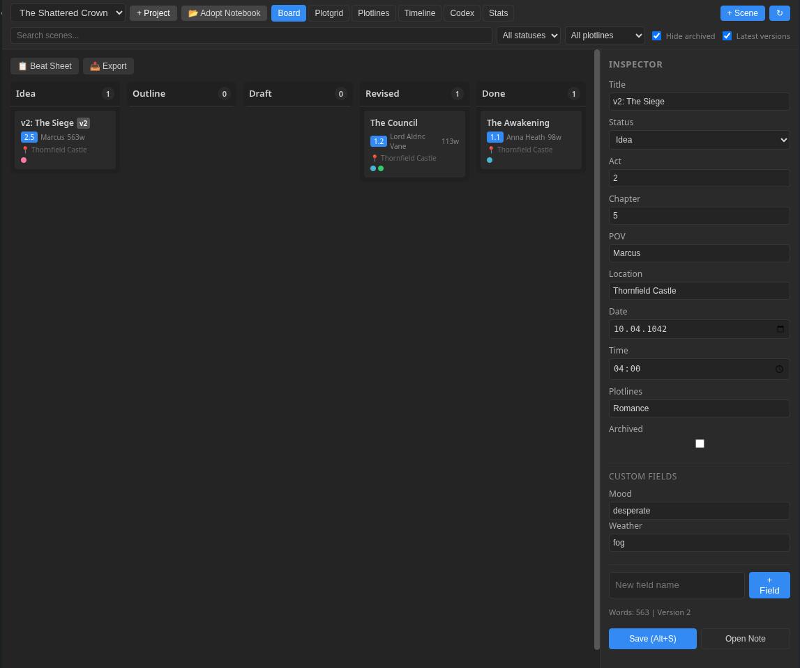
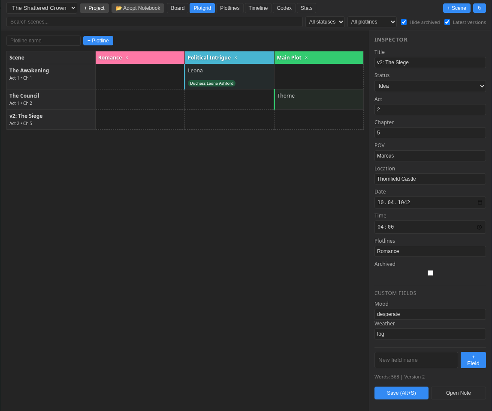
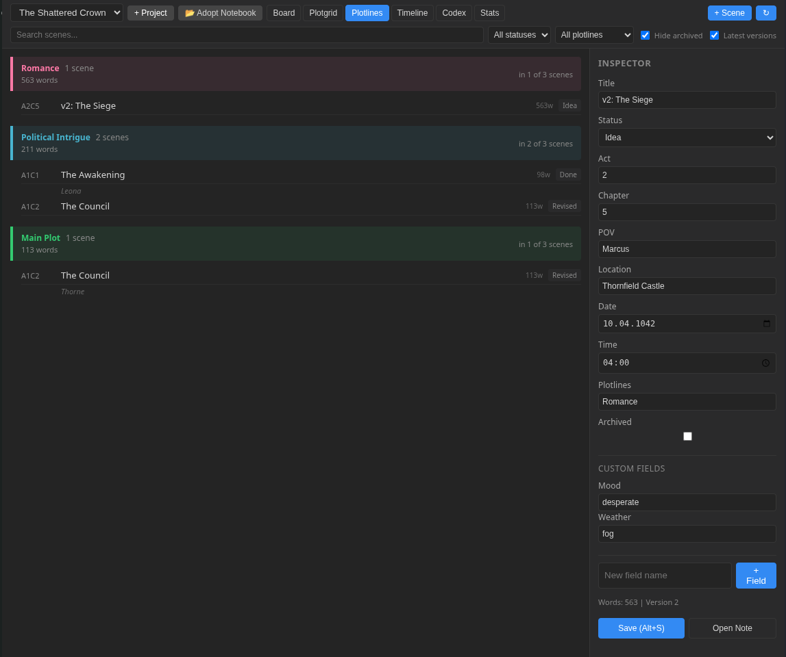
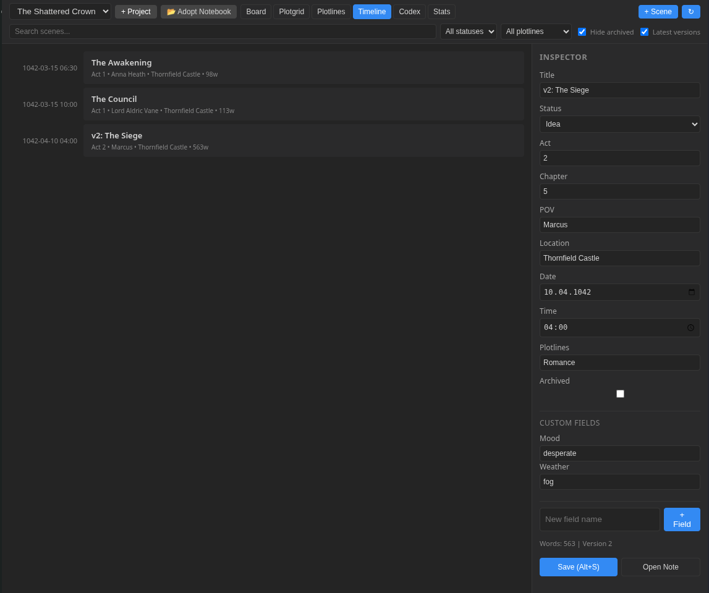
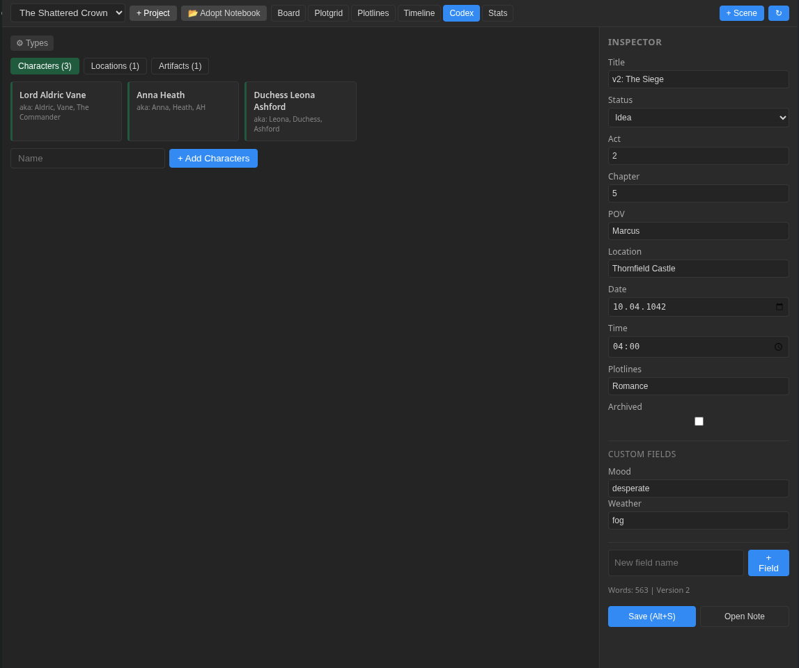
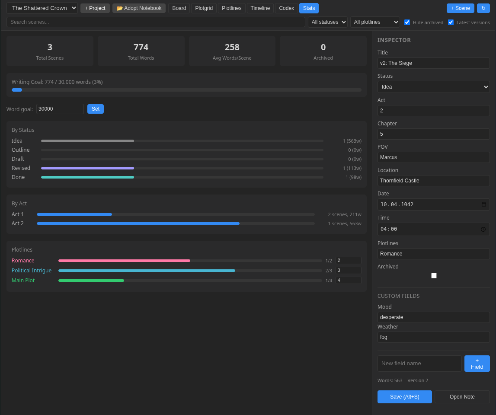

# StoryLine for Joplin

A fiction-writing assistant plugin that turns any Joplin notebook into a complete novel-planning workspace. Board, Plotgrid, Plotlines, Timeline, Codex, and Stats — plus an Inspector sidebar, beat sheet templates, and Markdown export.


> [!NOTE]
> **Status:** MVP. Covers the core novel-planning workflow: scene cards, plotline grids, chronological timelines, a configurable worldbuilding codex, and per-item metadata editing.


> [!TIP]
> Versions > 0.2.0 support mobile. [Get it here 🫴](publish/io.arena.joplin-storyline_v0.2.5.jpl)<br>
> Tested on Fairphone 6.


---

## Installation

```bash
npm install && npm run package
```

Install `io.arena.joplin-storyline_v0.2.5.jpl` via **Tools → Options → Plugins → Install from file**, then restart Joplin.

---

## Quick Start

1. Open StoryLine (**View → Toggle StoryLine**)
2. Click **+ Project** to create a new notebook — or select any note in an existing notebook and click **📂 Adopt Notebook**
3. Start adding scenes with **+ Scene**, build your world in the **Codex**, and track progress in **Stats**

> **Adopt works at any folder depth.** If the notebook already has a `StoryLine Config` note, it loads as-is. Otherwise one is created automatically.

---

## Views

### Board

Kanban columns: **Idea → Outline → Draft → Revised → Done**. Drag cards between columns. Cards show act/chapter, POV, word count, location, and plotline dots.

Action bar with **📋 Beat Sheet** and **📤 Export** buttons.



### Plotgrid

Spreadsheet grid — rows = scenes, columns = plotlines. Color-coded cells, gap visualization (dashed borders on empty cells), and **entity pills** that auto-detect characters, locations, and codex entries in cell text via alias matching.

- Type in any cell → plotline auto-assigned to scene
- Clear a cell → plotline auto-removed
- Double-click column header → rename plotline (content preserved)
- Click × → delete plotline (cleaned from all scenes)



### Plotlines

Per-plotline breakdown with scene lists, word counts, and presence ratios. Shows plotgrid notes per scene. Unassigned scenes flagged with ⚠.



### Timeline

Chronological scene list sorted by in-world date/time.





### Codex

Characters, locations, and custom types (artifacts, factions, magic systems — anything). Each entry has **aliases** for smart plotgrid matching. Type-colored cards and pills.



### Stats

Word counts by status/act/plotline, writing goal progress bar, and per-plotline **scene targets** (set how many scenes you expect per plotline — progress bar shows actual vs. target).



---

## Key Features

| Feature | Details |
|---------|---------|
| **Scene search & filter** | Search bar + status/plotline dropdowns + archive/version toggles. Applies across all views. |
| **Version detection** | Titles like `v1: The Siege`, `v2: The Siege` are grouped — only the latest version shows (toggle-able). |
| **Scene archive** | Checkbox in Inspector. Archived scenes hidden by default. |
| **Beat sheet templates** | Save the Cat (15 beats), Three-Act (9), Hero's Journey (12), Seven-Point (7). Template scenes stay hidden until you write 30+ words. |
| **Markdown export** | Outline (metadata table) or full manuscript (prose by act). Respects current filters. |
| **Alias matching** | Codex entries match by title + aliases. `"Anna Heath"` with aliases `Anna, Heath, AH` matches any of those terms. Ambiguous aliases (shared by 2+ entries) are skipped. |
| **Plotline management** | Add, rename (double-click), delete (with cleanup). Plotgrid content migrates on rename. |
| **Writing goal** | Set a word-count target in Stats. Progress bar turns green at 100%. Disable by clearing the field. |
| **Note prefixes** | Joplin sidebar shows `[Scene] [A1C02] Title`, `[Character] Name`, `[Location] Name` — StoryLine UI shows clean names. |
| **Adopt Notebook** | Point StoryLine at any existing notebook at any depth. |
| **Keyboard shortcuts** | `Alt+S` save, `Alt+R` reload. |
| **Responsive toolbar** | Buttons collapse to icons below 900px panel width. |

---

## How It Works

- **One notebook = one project.** A note titled `StoryLine Config` (JSON) stores settings.
- **Scenes** have `storyline_scene: true` in YAML frontmatter.
- **Codex entries** have `storyline_codex: <type>` (+ optional `aliases` field).
- **Plotgrid cells** are stored in Joplin's `userData` (syncs across devices).
- **Zero background activity.** No polling, no watchers, no temp files. API calls only on explicit user actions.

---

## Color Palette

Plotline colors cycle through maximally distinct hues:

Red → Teal → Blue → Green → Orange → Purple → Cyan → Magenta → Lime → Indigo

Existing projects keep their saved colors. New plotlines get auto-assigned from this palette.

---

## Changelog

### 0.2.0

**New views:**
- **Plotlines** — per-plotline scene lists with word counts and presence ratios
- **Stats** — dashboard with word counts, writing goal, status/act breakdown, plotline targets

**New features:**
- Scene search & filter bar (text, status, plotline, archive, version toggles)
- Version detection (`v1:`, `v2:` prefix) — auto-groups, shows latest only
- Scene archive (soft-hide via Inspector checkbox)
- Beat sheet templates (Save the Cat, Three-Act, Hero's Journey, Seven-Point)
- Markdown export (outline table or full manuscript)
- Writing goal tracker with progress bar
- Per-plotline scene targets in Stats
- `Alt+S` / `Alt+R` keyboard shortcuts
- Responsive toolbar (collapses below 900px)
- Maximally distinct color palette (full hue spread)

**Fixes:**
- Null-guard crash when scenes had missing titles
- Panel freeze on version detection with edge-case data

### 0.1.1 → 0.2.0 (accumulated)

- Plotline rename (preserves plotgrid content) and delete (cleans all scenes)
- Apostrophe matching in codex (`"Hannibal's Lair"` now matches)
- Alias disambiguation (shared aliases skipped)
- Type-colored pills (green=character, red=location, blue=artifact, etc.)
- Alias field on codex entries with substring matching
- Auto plotline ↔ plotgrid sync
- `[Scene] [A1C02]` / `[Character]` note title prefixes
- Adopt Notebook button (any folder depth)

### 0.1.0

- Initial release: Board, Plotgrid, Timeline, Codex, Inspector

---

## Architecture

| Decision | Why |
|----------|-----|
| One notebook = one project | Simple, matches Joplin's organization |
| Flat structure (no subfolders) | Found by frontmatter, not folder tree |
| `userData` for plotgrid cells | Syncs with Joplin's normal sync |
| Zero inline scripts | CSP-compatible with Joplin ≥ 3.6 |
| No dependencies | Bundle stays tiny (~22 KB) |

---

## Limits

| Concern | Practical limit |
|---------|----------------|
| Scenes per project | ~200–300 (plotgrid DOM becomes heavy) |
| Codex entries | ~500 |
| Sync overhead | Zero extra — uses Joplin's built-in sync |
| Background resource use | None — fully idle until interaction |

---

## License

MIT

